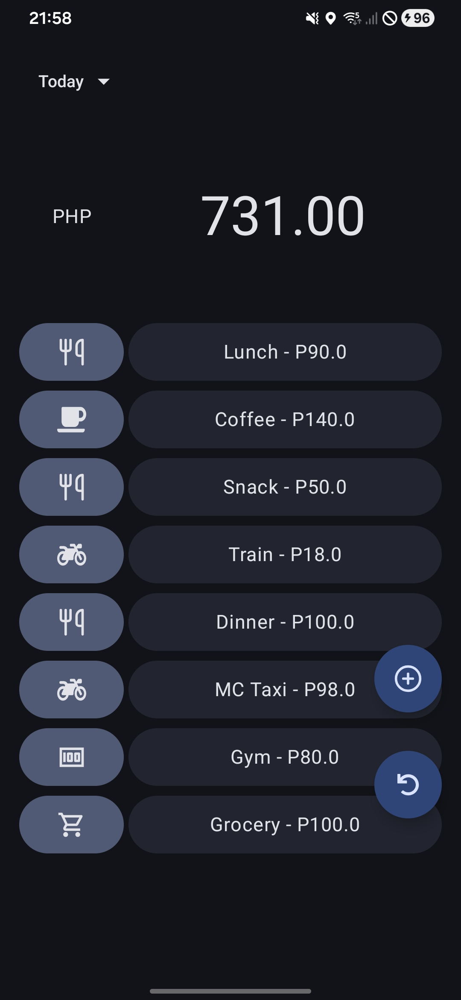
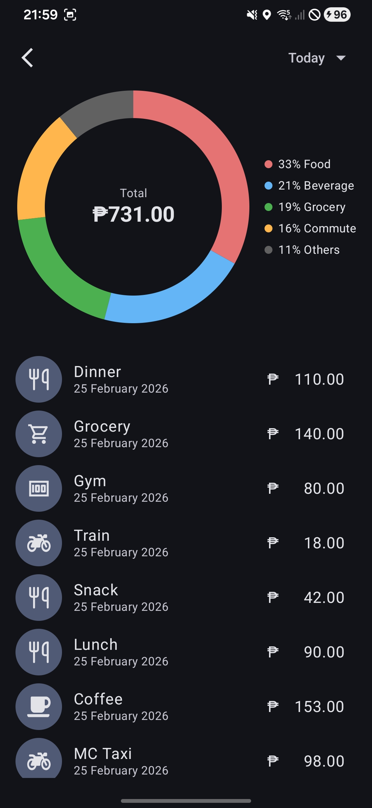

# 💰 Budget App

A modern Android budgeting app built with **Kotlin** and **Jetpack Compose** that makes tracking daily expenses fast and frictionless.

The app introduces **Expense Presets** — reusable expense buttons for recurring daily spending — allowing you to log expenses in a single tap while still supporting flexible custom amounts.

---

## ✨ Features

### 🔘 Expense Presets
Preloaded reusable expense buttons for common daily spending.

Example:
- ☕ Coffee – ₱90
- 🚕 Transport – ₱50
- 🍽 Lunch – ₱150

Instead of manually creating the same expense every day, just tap the preset.

---

### ✏️ Smart Customization
Even though presets have default amounts, you can override them.

Example:
- Usual coffee: ₱90  
- Today’s coffee: ₱80  

Tap the **Coffee preset**, adjust the amount, and log it —  
the **category and type are automatically reused**, reducing repetitive input.

---

### 📊 Expense Tracking
- Filter expenses by date range
- View total spending
- Category-based breakdown
- Clean Compose UI

---

### 🗂 Local-First Architecture
The app currently runs fully offline using Room database.  
A Spring Boot backend exists but is temporarily disconnected to focus on completing the mobile experience.

---

## 🛠 Tech Stack

### Android
- **Kotlin**
- **Jetpack Compose**
- **Room Database**
- **Koin (Dependency Injection)**
- **OkHttp**
- **Retrofit**

### Backend (Currently Disconnected)
- **Spring Boot**

---

## 🏗 Architecture

- MVVM Architecture
- Unidirectional UI State
- StateFlow for reactive UI updates
- Repository pattern
- Local persistence with Room

High-level flow:
UI (Compose) ->
    ViewModel (State + Events) ->
        Repository ->
            Room Database

---

## 🚀 Why Expense Presets?

Most budgeting apps require repetitive manual input.

This app is optimized for:
- Daily recurring expenses
- Speed logging
- Minimal friction
- Habit-friendly tracking

The goal is to make logging expenses as easy as sending a chat message.

---

## 📦 Future Improvements

- Backend reconnection (Spring Boot API)
- Multi-device sync
- Authentication
- Analytics dashboard
- Charts & insights
- Export to CSV

---

## 📸 Screenshots

